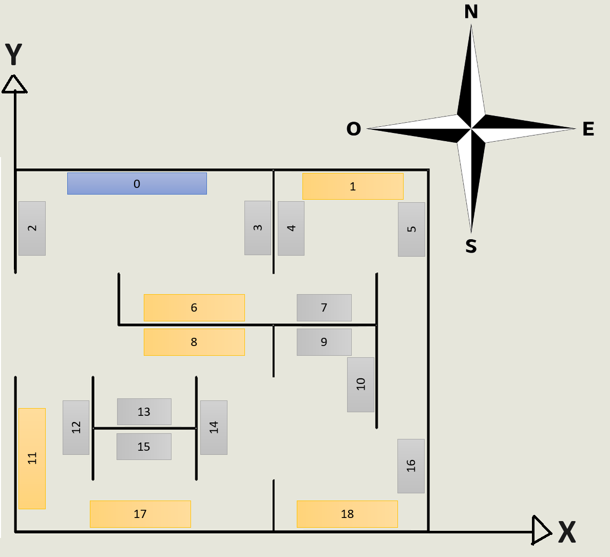
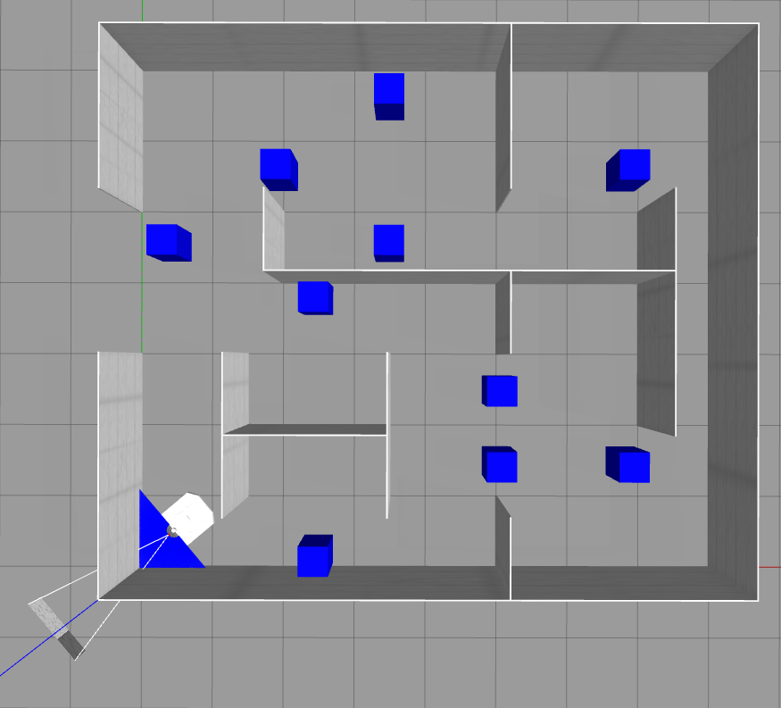

# Distribución de cuadros en el escenario

# Ubicaciones de los puntos de parada

| Cuadro |	x |	y |	Orientación |
|:------:|:--:|:-:|:-----------:|
| C0 |	2,5 |	6,0 |	- |
| C1 |	6,5 |	6,0 |	N |
| C2 |	-- |	-- |	| 
| C3 |	-- |	-- |	|
| C4 |	6,5 |	6,0 |	O |
| C5 |	6,5 |	6,0 |	E |
| C6 |	-- |	-- |	|
| C7 |	-- |	-- |	|
| C8 |	-- |	-- |	|
| C9 |	6,0 |	3,0	| N |
| C10 |	6,0 |	3,0 |	E |
| C11 |	-- | 	-- | |	
| C12 |	-- |	-- | |	
| C13 |	2,5 |	3,0 |	S |
| C14 |	4,5 |	2,0 |	O |
| C15 |	2.5 |	1,0 |	N |
| C16 |	6,5 |	1,0 |	E |
| C17 |	2.5 |	1,0 |	S |
| C18 |	6,5 |	1,0	| S |

# Ubicaciones de los QR

| QR |	x |	y |	z |
|:---:|:---:|:----: |:---:|
| QR0 |	1,0 |	7,0 |	1,0 |
| QR1 |	5,3 |	7,0 |	1,0  |
| QR2 |	0,0	| 5.3 |	1,0  |
| QR3 |	5,0 |	6,7 |	1,0  |
| QR4 |	5,0 |	5,3 |	1,0  |
| QR5 |	8,0 |	6,7 |	1,0  |
| QR6 |	4,7 |	4,0 |	1,0  |
| QR7 |	6,7 |	4,0 |	1,0  |
| QR8 |	2,3 |	4,0 |	1,0  |
| QR9 |	5,3 |	4,0 |	1,0  |
| QR10 |	7,0 |	3,7 |	1,0  |
| QR11 |	0,0 |	0,3 |	1,0  |
| QR12 |	1,5 |	2,7 |	1,0  |
| QR13 |	3,2 |	2,0 |	1,0  |
| QR14 |	3,5 |	1,3 |	1,0  |
| QR15 |	1,8 |	2,0 |	1,0  |
| QR16 |	8,0 |	1,7 |	1,0  |
| QR17 |	3,7 |	0,0 |	1,0  |
| QR18 |	7,7 |	0,0 |	1,0  |

# Ubicaciones de los posibles obstaculos
Tomando como origen de coordenadas la esquina inferior izquierda las coordenadas de los obstaculos son las siguientes:

| Obstaculo | X | Y |
| :--: |:----:|:----:|
| O1 | 2,00 | 5,50 |
| O2 | 3,50 | 4,50 |
| O3 | 3,50 | 6,50 |
| O4 | 6,75 | 5,50 |
| O5 | 6,75 | 1,50 |
| O6 | 5,00 | 1,50 |
| O7 | 5,00 | 2,50 |
| O8 | 2,50 | 3,75 |
| O9 | 2,50 | 0,25 |
| O10 | 0,50 | 4,50 |

Como se pueden ver en la siguiente imagen.

